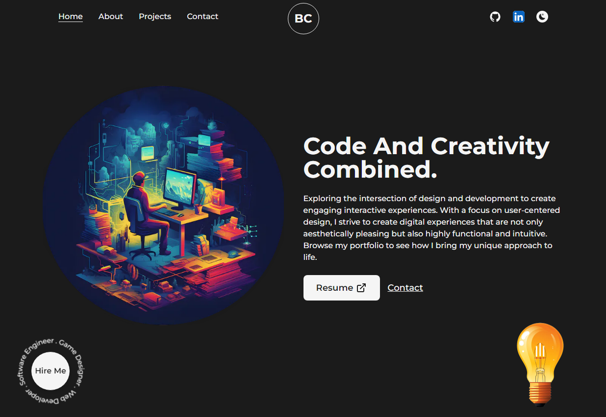
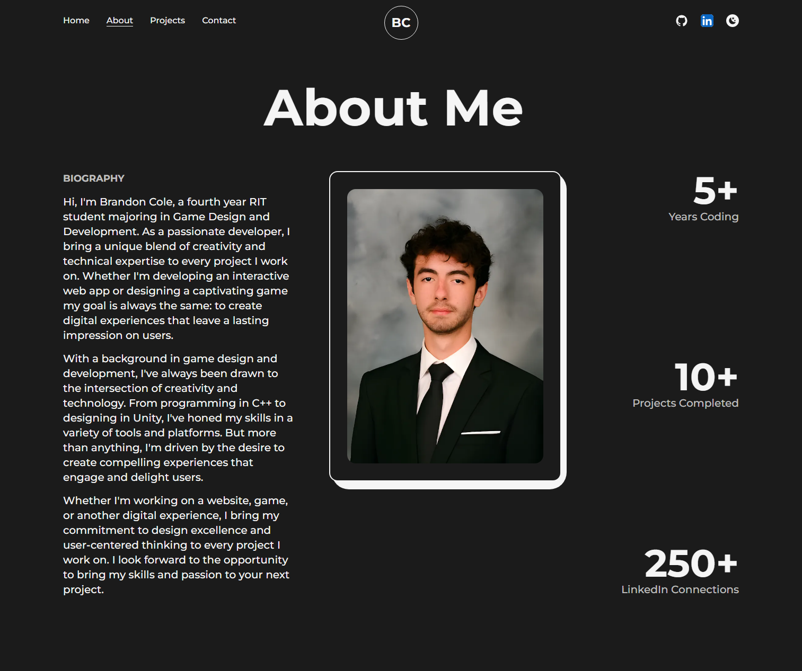
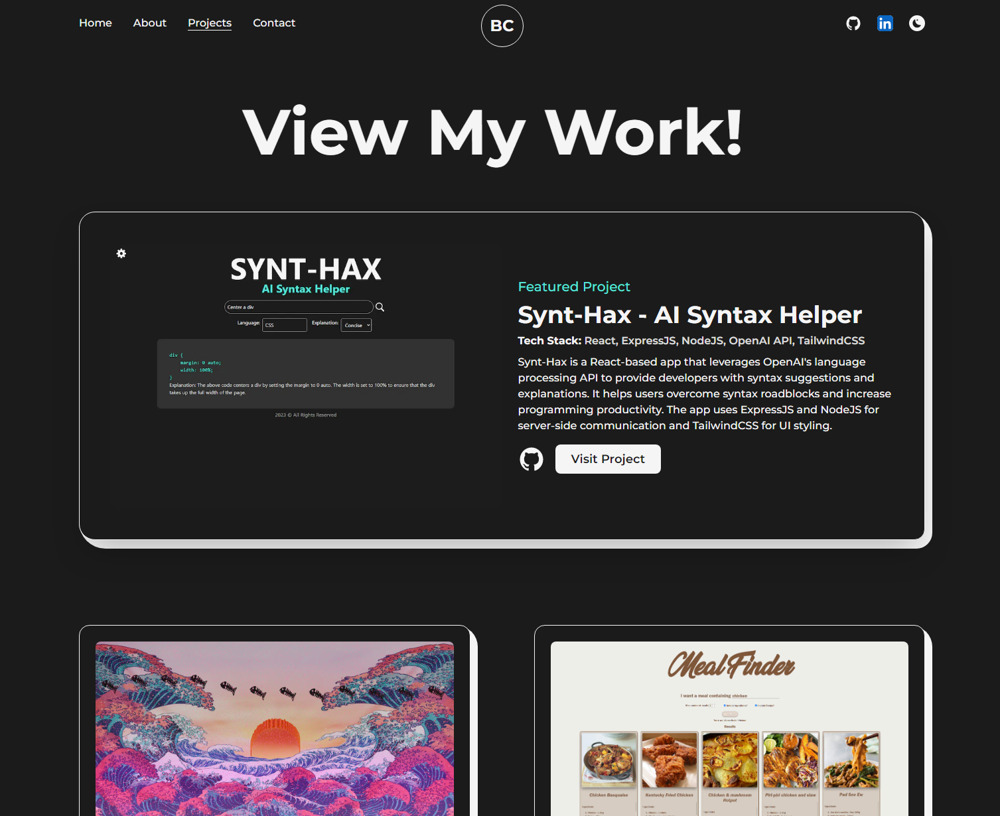
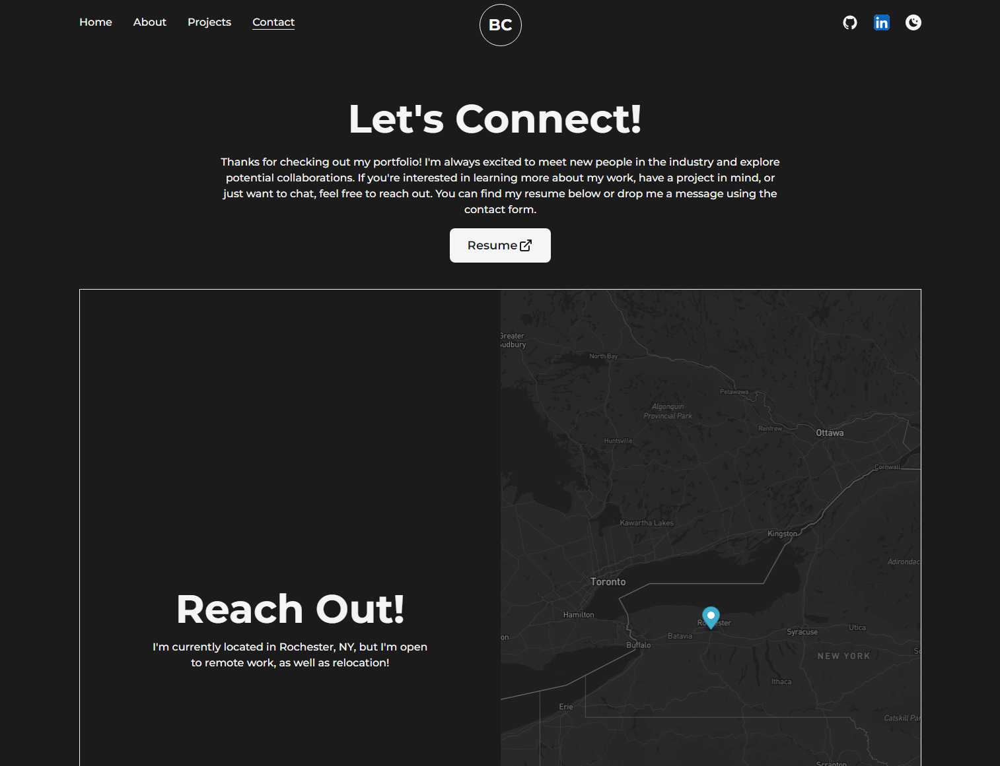

<h3 align="center">My Portfolio</h3>

  <a href="https://brandoncole.dev/">Live Demo</a>

---

 Full Stack Developer Portfolio
      

## 📝 Table of Contents
- [About](#about)
- [Built Using](#built_using)
- [Resources](#resources)
- [Author](#author)

## 🧐 About 
 Portfolio website, built with Next.js, Framer Motion, Mapbox GL, and React Hook Form. The site features smooth animations, an interactive map, and flexible form validation. I used ESLint with the Next.js configuration for code quality and deployed on Vercel for speed and reliability.

## ⛏️ Built Using 
- [React](https://react.dev/) - Web framework
- [NodeJs](https://nodejs.org/en/) - Server Environment
- [TailwindCSS](https://tailwindcss.com/) - Styling
- [Framer Motion](https://www.framer.com/motion/) - Animations
- [React Hook Form](https://react-hook-form.com/) - Form Validation
- [Mapbox](https://www.mapbox.com/) - Map

## Resources Used in This Project 

- Fonts from https://fonts.google.com/  
- Icons from https://iconify.design/  

## ✍️ Author 
- [@realbcole](https://github.com/realbcole)
